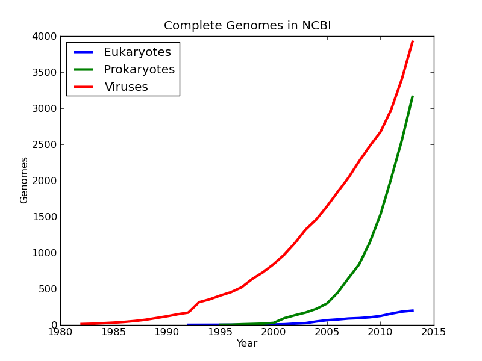
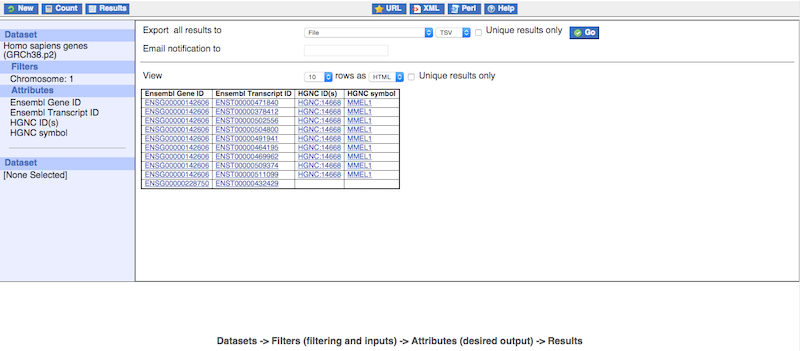

## About the Ensembl project

Ensembl is a joint project between [European Bioinformatics Institute](http://www.ebi.ac.uk/) (EMBI-EBI), an outstation of the European Molecular Biology Laboratory (EMBL), and the [Wellcome Trust Sanger Institute](http://www.sanger.ac.uk/) (WTSI). Both institutes are located on the Wellcome Trust Genome Campus in Hinxton, south of the city of Cambridge, United Kingdom.

Ensembl is one of the world's primary resources for genomic research, a
resource through which scientists can access the human genome as well as
the genomes of other model organisms. Because of the complexity of the
genome and the many different ways in which scientists want to use it,
Ensembl has to provide many levels of access with a high degree of flexibility.
Through the Ensembl website a wet-lab researcher with a simple web browser
can for example perform BLAST searches against chromosomal DNA,
download a genomic sequence or search for all members of a given protein
family. But Ensembl is also an all-round software and database system that
can be installed locally to serve the needs of a genomic centre or a
bioinformatics division in a pharmaceutical company enabling complex data
mining of the genome or large-scale sequence annotation.

With the rapid development of next generation sequencing technologies, we are experiencing a exponential growth of sequencing data. This raw data can be very valuable when provided with proper annotation.

(taken from [Greg Zynda's blog](http://gregoryzynda.com/ncbi/genome/python/2014/03/31/ncbi-genome.html))

In response to the acceleration of the public effort to sequence the human genome, the Ensembl project was started in 1999.

> ## Three main goal of Ensembl
> 1. Provide a scalable way to storing and retrieving genomic data
> 2. Automatically annotate the genome and integrate with other available biological data
> 3. Provide a website for genome display for public
{: .callout}

Ensembl provides access to genomic information with a number of
visualisation tools. The Ensembl website gives you the possibility to directly
download data, whether it is the DNA sequence of a genomic contig you are
trying to identify novel genes in, or positions of SNPs in a gene you are
working on. An updated version of the website is released bimonthly. Old
versions are accessible on the ‘Archive!’ website, dating back two years. Apart
5from that the ‘Pre!’ website provides displays of genomes that are still in the
process of being annotated. There is also an ftp site to download large
amounts of data from the Ensembl database, as well as the data-mining tool
BioMart, that allows rapid retrieval of information from the databases, and
BLAST/BLAT sequence searching and alignment.

## What is BioMart

BioMart is an easy-to-use web-based tool that allows extraction of data without any programming knowledge or understanding of the underlying database structure. You can navigate through the BioMart web interface using the left panel. Filters and attributes can be selected in the right panel. A summary of your choices is also displayed in the left panel.

You can think of it as a search engine like google, that you can search for multiple terms and put the result in as table format.

> ## Ways of retrieving data using BioMart
> 1. Webpage
> 2. BiomaRt Bioc R packages
> 3. Perl API
> 4. RESTful access
{: .callout}

We will walk through how to use BioMart in the next session.
