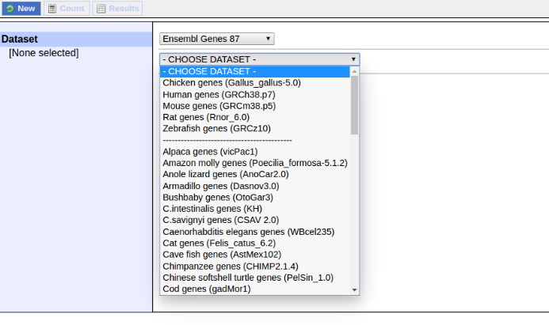
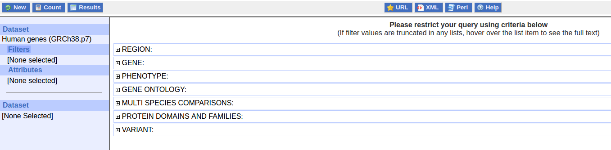
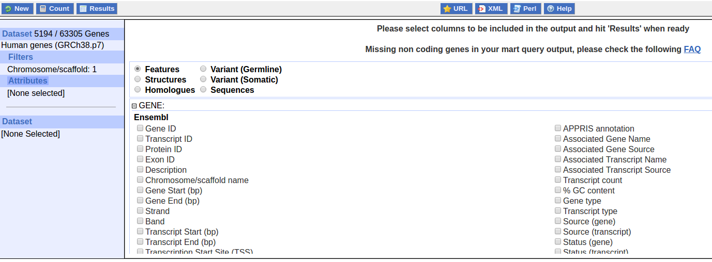
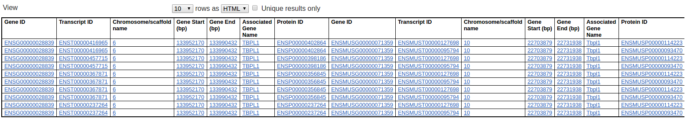

## What is BioMart?

BioMart is an easy-to-use web-based tool that allows extraction of data without any programming knowledge or understanding of the underlying database structure. You can navigate through the BioMart web interface using the left panel. Filters and attributes can be selected in the right panel. A summary of your choices is also displayed in the left panel.

## Let's walk through it!

### 1. Select a mart database

> ## Type of dataset
> * Ensembl Genes: This mart contains the Ensembl gene set and allows you to retrieve Ensembl genes, transcripts and proteins as well as external references, microarrays, protein domains, structure, sequences, variants (only variants mapped to Ensembl Transcripts) and homology data.
> * Ensembl Variation: This mart allows you to retrieve germline and somatic variants as well as germline and somatic structural variants. This mart also contains variants' phenotypes, citations, synomyms, consequences and flanking sequences; you can also retrieve Ensembl genes, transcripts, regulatory and motif features mapped to variants.
> * Ensembl Regulation: This mart allows you to retrieve regulatory features, evidence and segments, miRNA target regions, binding motifs and other regulatory regions.
> * Vega: This mart contains the Ensembl Vega gene set (manual annotation coming from Havana) and allows you to retrieve Ensembl Vega genes, transcripts and proteins as well as external references, structures, sequences and protein domains.
> * Mouse strains: Annotated date from Mouse Genomes Project.
{: .callout}

### 2. Select a mart dataset

Only the Ensembl Genes database contain all the infromation of ensembl species, which is full-listed on [species page](http://asia.ensembl.org/info/about/species.html).
The other databases only contain a limited number of species, mostly human.

### 3. Filter you mart query

BioMart allows you to restrict your query with information that you know, e.g: input a list of IDs, restrict to a region. You can access the filter page by clicking on the "Filters" button located on the left panel. Filters are organised into different sections, clicking on the "+/-" boxes will expand/collapse a section and display its content.

In the following figure, I expanded the *Region* section and set the filter on chromosome 1, which will shows all the human gene on chromosome 1.

> ## What to do if I want to know how many genes are on chromosome 1?
> You can simply click on the **Count** button located on the upper left of the page. It will tell you how many entries in the database that satisfy your filters.
>
> From that we can know that there are 5194 out of 63305 genes locate on chromosome 1 in human genome.
{: .callout}

### 4. Select mart Attributes

By clicking on the **Attributes** button on the left panel, you will access the mart attribute page. This page allows you to select your desired output; the default output is "Ensembl Gene ID" and "Ensembl Transcript ID" in the Ensembl Genes mart. The attributes are organised in pages that you can access by selecting the radio buttons.

### 5. Display and retrieve your query

Clicking on the **Results** button will bring you to the mart result page. This page will, by default, show you a preview of the first 10 results of your query in HTML format. The number of results previewed and format can be changed. You can also automatically remove all the duplicated results from your query by checking the **Unique results only** button.

If you are happy with your query, you can use the "Export all results to" section (select a format and click on the "Go" button) to download your results. You can choose to view your result in window or sent to your by email. Different format are supported including: HTML, CSV, TSV and XLS.

Clicking on the hyperlink of gene ID will direct you to the entry in Ensembl database. It will give you more details on the gene.

### 6. About query

Most research starts from asking questions. If you have a question in mind and provided with BioMart, how would you do to get informatin that you are interested in?

For example your question is:

> For all mouse genes on chromosome 10 that are protein coding, I would like to
> know the IDs in both Ensembl and PDB.Are there Illumina probes and GO IDs for
> these genes?

In the query, filter is what we know and attribute is what we don't know.
In order to construct a query, we need to deconstruct our question.

* What we know here are *mouse genes*, *chromosome 10* and *protein coding*.

* What we don't know or what we are interested in are *Ensembl ID*, *PDB ID*, *Illumina probes* and *GO ID*.

Apply these information respectively to the filter and attribute, we may be able to acquire information we need.

> ## Exercise 1
>
> How many genes are there on chromosome 18? What about chromosome 1, 10 and 18 combined together?
>
> > ## Solution
> >
> > There are 1170 genes on chromosome 18 and 8568 in total on chr1, 10 and 18.
> >
> {: .solution}
{: .challenge}

> ## Exercise 2
>
> What are the gene ID, transcript ID, gene name(HGNC symbol) and coordinates (chromosome name, gene start and gene end) of genes SMAD2, SMAD3 and SMAD4?
> Can you observe something wired?
>
> > ## Solution
> >
> > ENSG00000175387	ENST00000262160	SMAD2	18	47808957	47931146
> >
> > ENSG00000166949	ENST00000559460	SMAD3	15	67063763	67195195
> >
> > ENSG00000141646	ENST00000588860	SMAD4	18	51028394	51085045
> >
> > The results has more entries than the count shows us. The reason is that the count only counts the number of gene that you select. If these gene has multiple transcripts, they would be shown in different entries.
> {: .solution}
{: .challenge}

> ## Exercise 3
>
> Can you find out all the genes on chromosome 6 that belong to protein family [PF00352](http://pfam.xfam.org/family/PF00352)?
> Please find information of the gene ID, gene name(HGNC symbol), coordinates, gene type and transmembrane domain(tmhmm).
>
> > ## Solution
> >
> > ENSG00000112592	TBP	6	170554302	170572870	protein_coding NA
> > 	
> > ENSG00000028839	TBPL1	6	133952170	133990432	protein_coding NA
> >
> {: .solution}
{: .challenge}

> ## Exercise 4
>
> SMAD2 gene is located on chromosome 18 in band q21.1.
> Which other genes with consensus coding sequences assigned by
the CCDS project locate to the same band? What are their cDNA sequences?
>
> > ## CCDS Project
> > The Consensus Coding Sequence(CCDS) project is a collaborative effort to identify a core set of protein coding regions that are consistently annotated and of high quality
> >
> > 
> >
> {: .callout}
>
> > ## Solution
> > There are 33 genes that satisfy this filter.
> >
> > 
> >
> > Filter setting:
> > * chromosome: 18
> >
> > * Band start: q21.1; end: q21.1
> >
> > * Limites to genes with CCDs ID only
> >
> > 
> >
> > Attribute setting:
> >
> > * Sequence: cDNA sequences
> >
> > 
> >
> > * Header information
> >
> > 
> >
> > Results:
> >
> > 
> >
> >
> {: .solution}
{: .challenge}

## Combining multi-species data

BioMart also support intersect searching in different databases and mart dataset.

Let's say you want to know the genes that belongs to [PF00352](http://pfam.xfam.org/family/PF00352) in human and mouse.

You can simply click the other **Dataset** button located on the lower of the left panel.

And do the same thing to set up the filter and attribute, you will get the results that you are interested in.

