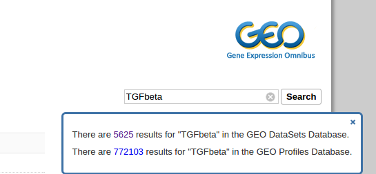
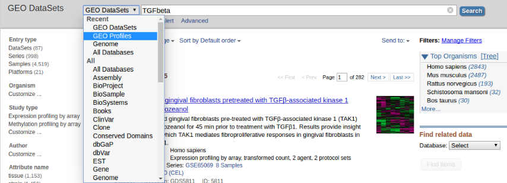
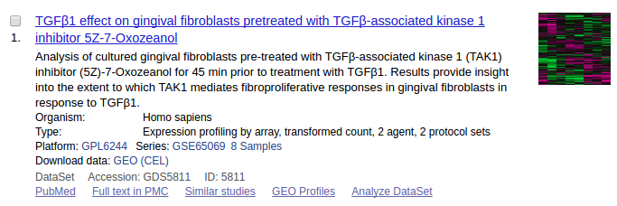
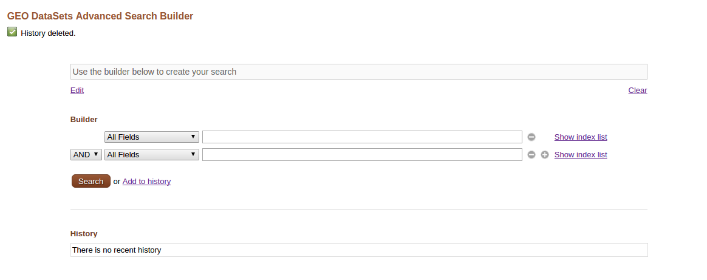
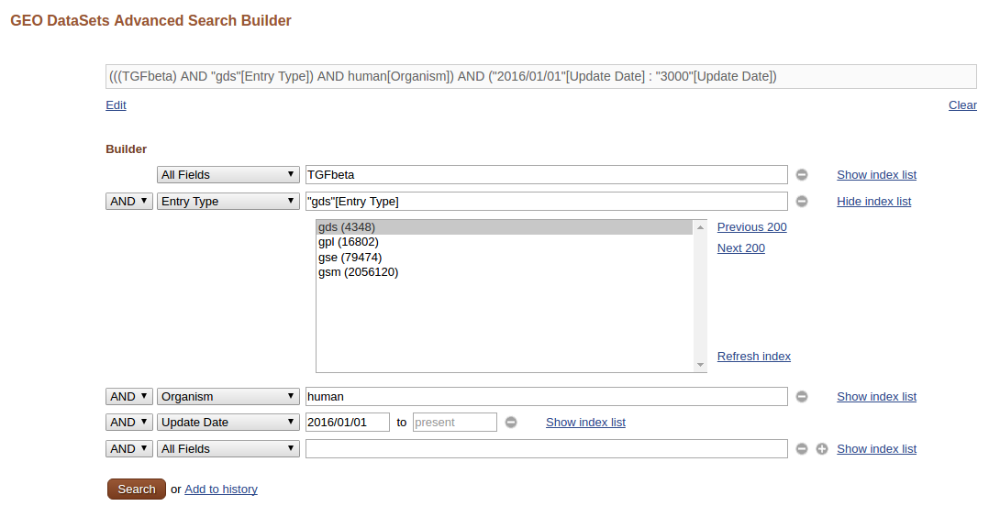
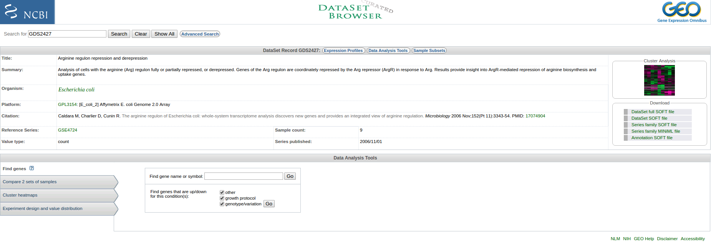
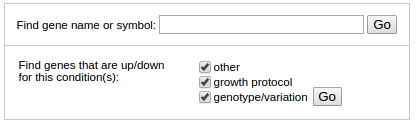
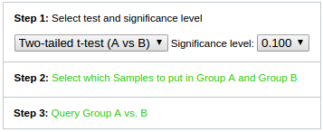

## Search in GEO

There are various ways of searching in GEO. You can simply key in key words in the query box in GEO. If you are aware of what kind of data you are looking for, you can also choose which database to search.

If you search on GEO index page, you will get this:

Click on the hyperlinks of DataSets and Profiles and you will be directed to the query result page of that database.

Also, when you are in searching of a database, you can choose to switch database in the drop down menu.

You can change the display setting of your results to find out your information quickly.
There are also various filter that you can set to filter out those results you don't want.
You can choose organism, study type, entry type and publication date of your own interests.

The results will be display like the following figure:

It shows brief summary of the entry, organism, study type and some useful link to more details of the entry.

## Advanced search in GEO

One of the most useful feature of NCBI databases, which GEO is one of them, is that it support powerful advanced search.

Let's say I am interested in find all GEO DataSets that related to TGFbeta in human from last year till now. I can create a advanced search using Advanced Search Builder like this:

> ## Query sentence
>
> The query sentence in the grey box is generated by Advanced Search Builder.
>
> Generally, you can copy the query sentence on the top grey box to be used as query in other NCBI databases. But in this case, other databases may not have the attribution for the GDS entry type.
>
>
{: .callout}

## GEO DateSets

In the previous section, we've know briefly what is a GEO DataSet. Now we are going to explore more about it.

* **Descriptive information**: This section includes the DataSet title, summary, organism, Platform, citation(s), the original (reference) Series upon which the DataSet is based, the type of values the Samples have, the number of Samples the DataSet contains and the date on which the original Series was made public.

* **Expression Profiles**: It will direct you to another page listing all the genes expression profile in this DataSet

* **Data Analysis Tools**: Advanced features that are analyzed and curated by GEO. Often a good start for you question.

  * Find Gene: Type in gene symbol to be directed to relevant Profile page.

  

  Find genes that are up/down for this condition(s) can help you find those differentially expressed genes in different subset of the DataSet.

  * Compare 2 sets of samples: Help identify genes that display marked differences in expression level between two sets of Samples (Group A and Group B)

  

  

* **Sample subset**: Describe how the samples are assembled in this DataSet.

* **Thumbnail cluster image**: Provide a overview of the expression profile in this DataSet
