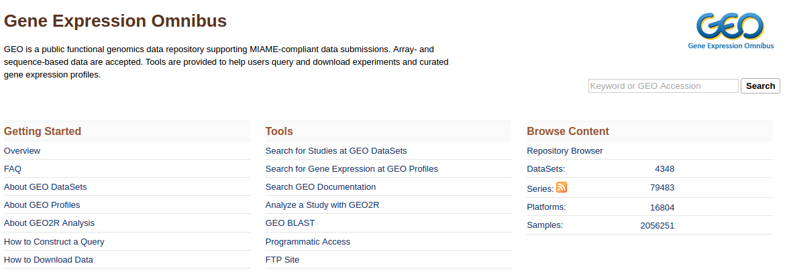
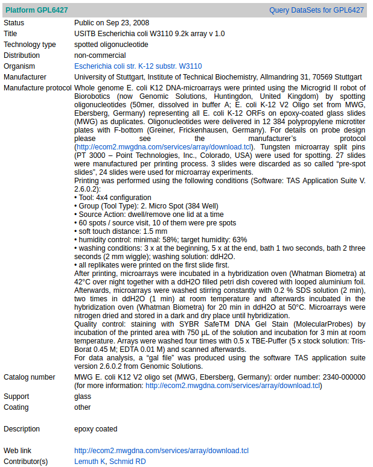
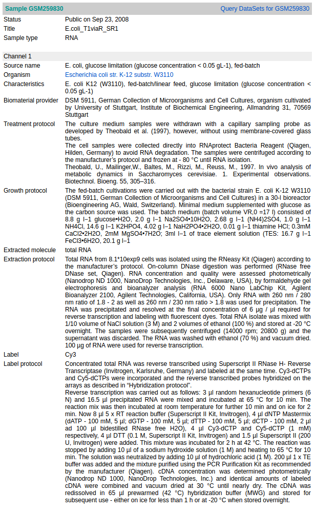
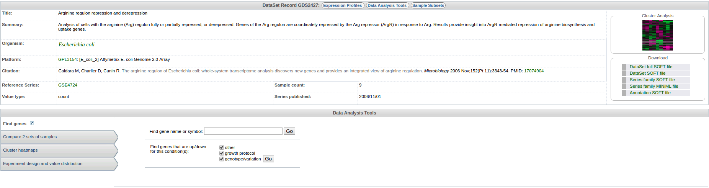
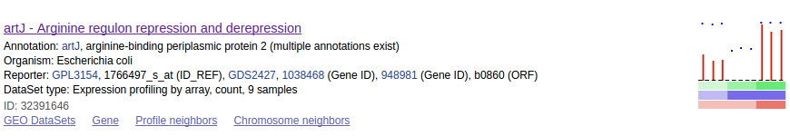

## About GEO

[Gene Expression Omnibus(GEO)](https://www.ncbi.nlm.nih.gov/geo/) is an online public database for archiving and distribution of gene expression data, which comes from microarray, next generation sequencing and other forms of high-throughput functional genomic data.

GEO allows user to submit, browse and retrieve various gene expression data.
One of the reason why GEO is so commonly used is that it supports MIAME-compliant data submissions.
Microarray data submitted by the scientific community need to support [MIAME](https://www.ncbi.nlm.nih.gov/geo/info/MIAME.html)(Minimum Information about a Microarray Experiment), which is a generally agreed standard of many journals and funding agencies.

> ## Three main goals of GEO are to
> 1. Provide a robust, versatile database in which to efficiently store high-throughput functional genomic data.
>
> 2. Offer simple submission procedures and formats that support complete and well-annotated data deposits from the research community.
>
> 3. Provide user-friendly mechanisms that allow users to query, locate, review and download studies and gene expression profiles of interest.
>
{: .callout}

### Submission guide

GEO accepts different kinds of data including high–throughput functional genomic data, which include all array based applications and some high-throughput sequencing data. The curators will provide as much assistance for submitting data to GEO. One can submit data as spreadsheets like Excel, plain text or as XML document. Among these, Excel is the most recommended method for submission. Data which can be submitted include common commercial arrays like Agilent, Illumina, Nimblegen or Affymetrix which has unique properties and file types. The microarray data which are being submitted have to be in raw data format, this helps to understand and verify the data as described in the MIAME guidelines. If the submitter wants to delete a record from the database, they need to give a request by providing the accession number of the respective record. Only the GEO members have the permission to delete a record.

### Data organization

The data from expression studies can be organized in platform records, sample records, series records, dataset and profile.

> ## Terms in GEO
> * Submitter: A submitter entity contains contact and authentication information about the submitter. This information is kept
only so that the source of data in GEO can be properly referenced. A submitter entity may have relationships to many platforms, many samples and many series.
>
{: .callout}

 * **Platform**: A platform record describes the list of elements on the array (e.g., cDNAs, oligonucleotide probesets, ORFs,
antibodies) or the list of elements that may be detected and quantified in that experiment (e.g., SAGE tags,
peptides). Each platform record is assigned a unique and stable GEO accession number (**GPLxxx**). A platform may
reference many samples that have been submitted by multiple submitters.

 * **Sample**: A sample record describes the conditions under which an individual sample was handled, the manipulations it
underwent and the abundance measurement of each element derived from it. Each sample record is assigned a
unique and stable GEO accession number (**GSMxxx**). A sample entity **must reference only one platform**, and may
be included in multiple series.

 * **Series**: A series record defines a set of related samples considered to be part of a group, how the samples are related and
if and how they are ordered. A series provides a focal point and description of the experiment as a whole. Series
records may also contain tables describing extracted data, summary conclusions or analyses. Each series record is
assigned a unique and stable GEO accession number (**GSExxx**).

* **GEO DataSets**:

A DataSet represents a curated collection of biologically and statistically comparable GEO Samples and forms the basis of GEO's suite of data display and analysis tools.
After submission data are refined and reassembled by GEO staff into GEO Dataset records (**GDSxxx**).

GEO DataSets have advanced data display and analysis features, as well as gene expression level identifying tools and cluster heat maps.

Samples within a DataSet refer to the same Platform, that is, they share a common set of array elements.  
The values for each Sample within a DataSet are calculated by background processing and normalization which are consistent across the dataset subsets.
Information reflecting experimental factors is provided through DataSet subsets.

Not all submitted data are suitable for DataSet assembly and GEO are experiencing a backlog in DataSet creation, so not all Series have corresponding DataSet record(s).

Both Series and DataSets are searchable using the GEO DataSets interface, but only DataSets have adcanced features.

* **GEO Profiles**:

**Profiles are derived from curated GEO datasets.**

GEO Profile is a gene based database where the user can search for gene expression profiles. Every single profile is represented as a chart which is displaying the expression level of one gene across all samples within a Dataset. Experimental details are represented as bars along the bottom of the charts. It is also possible to view the similarly expressed genes within close proximity on the chromosome. All the profiles are connected with internal links to represent similarly behavioring genes and external links to significant records in other NCBI databases. It can be searched with any keywords, gene names, gene symbols, GenBank accession number or profiles flagged as being differently expressed.

> ## DataSets & Profile
>
> * GEO DataSets is a *study-level* database, which stores descriptions of all original submitter-supplied records, as well as curated DataSets.
>
> * GEO Profiles is a *gene-level* database which users can search for gene expression profiles relevant to their interests.
>
{: .callout}

> ## Exercise
> 1. Record which forms an original record from the submitter, summarizing an experiment.
>
>    **A**. Series **B**. Platform  **C**. Sample  **D**. GEO Profile
>
> 2. Gene based database where the user can search for gene expression profiles.
>
>    **A**. GEO DataSet **B**. MIAME **C**. Platform **D**. GEO Profile
>
> 3. MIAME stands for
>
>    **A**. Maximum Information About a Microarray Experiment
>
>    **B**. Minimum Information About a Molecule Experiment
>
>    **C**. Minimum Information About a Microarray Experiment
>
>    **D**. Minimum Information About a Microanalysis Experiment
>
> 4. Which record is assigned with the unique identification number GSMxxx ?
>
>    **A**. Platform record	 **B**. Series record **C**. Sample record **D**. GEO Dataset
>
> > ## Solution
> >
> > A---Series may contain summary and conclusion of the data.
> >
> > D---DataSets are study-based database.
> >
> > C---MIAME is standard for microarray data.
> >
> > C
> >
> {: .solution}
{: .challenge}
